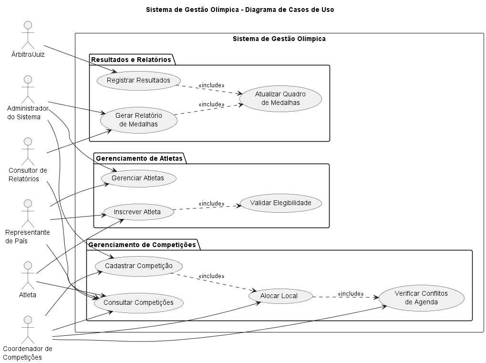
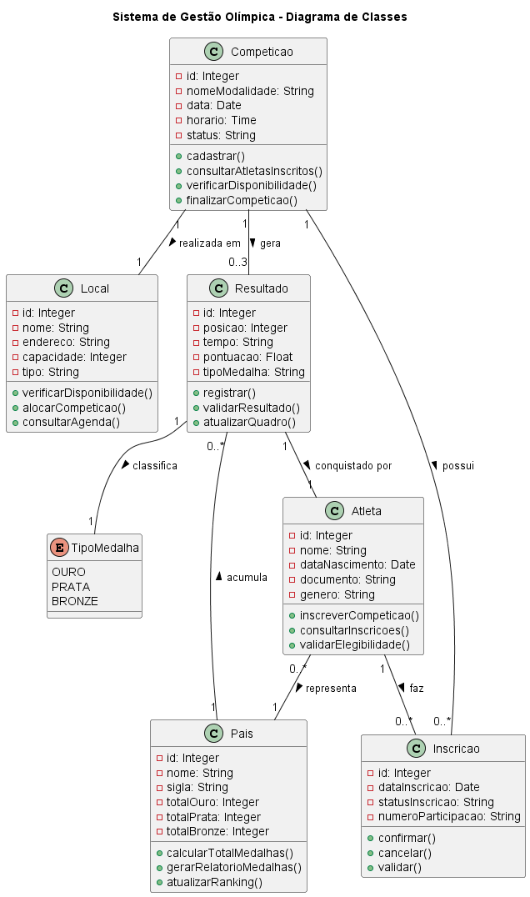
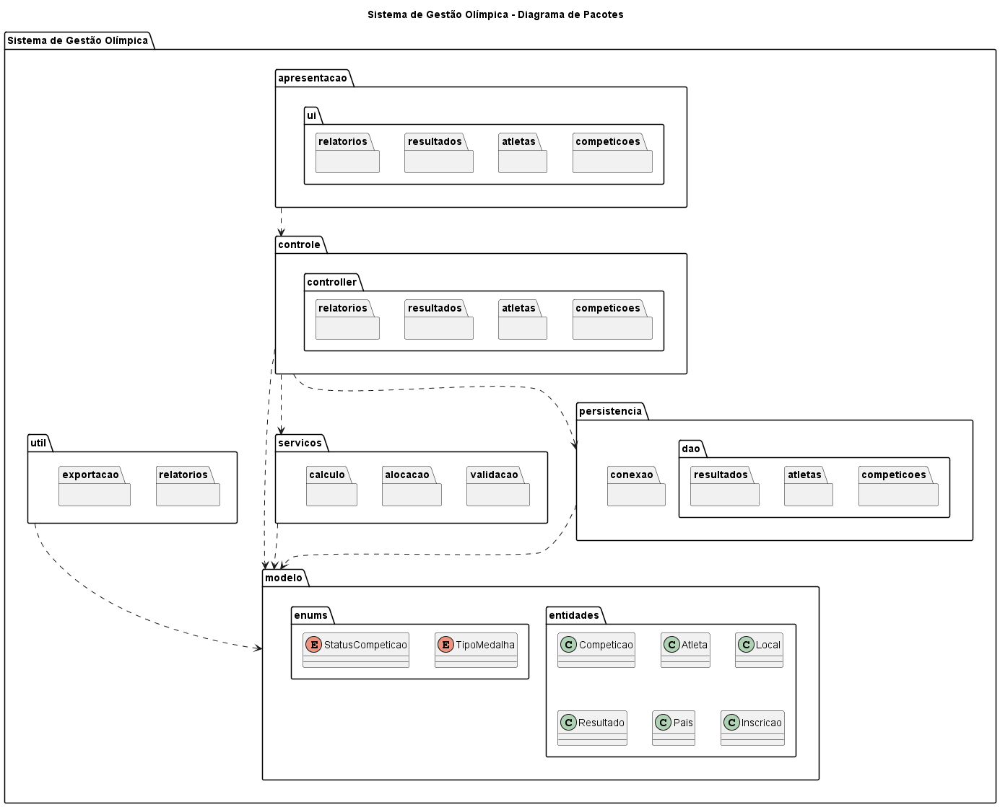
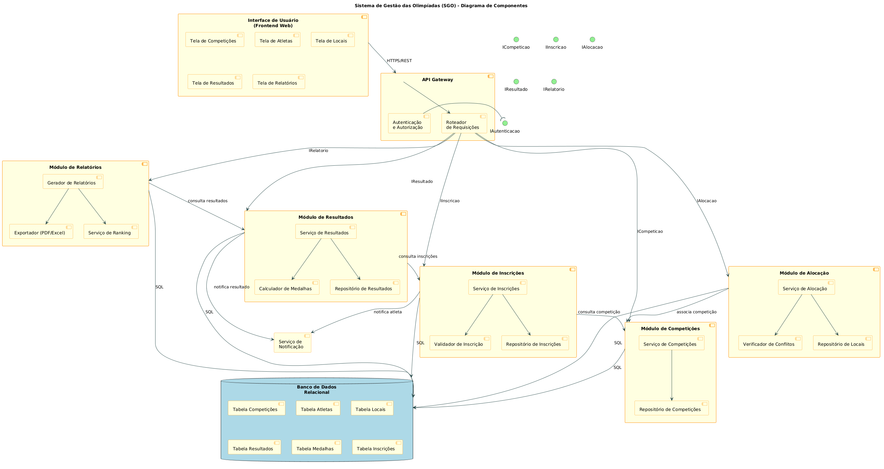
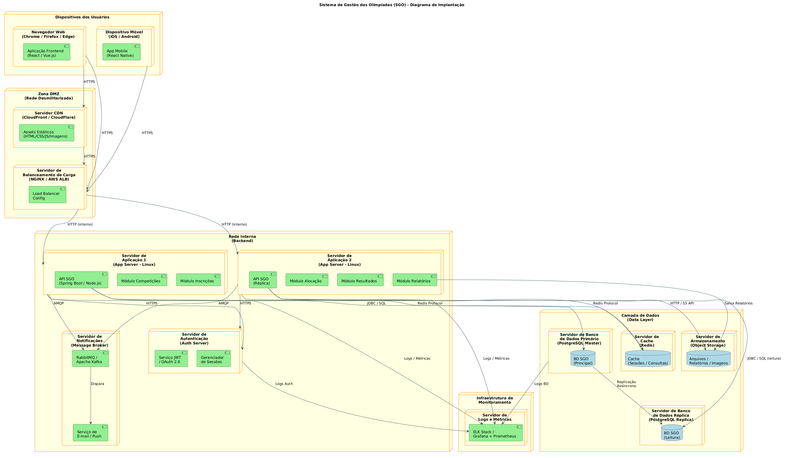

<!-- Sistema de Gestão das Olimpíadas - SGO | PUC Minas | Projeto de Software -->

# 🏅 Sistema de Gestão das Olimpíadas (SGO) 👨‍💻
<table>
  <tr>
    <td width="800px">
      <div align="justify">
        O <b>SGO — Sistema de Gestão das Olimpíadas</b> é um projeto de modelagem de software desenvolvido na disciplina de <i>Projeto de Software</i> do curso de <b>Engenharia de Software da PUC Minas</b>. O sistema foi concebido para atender às demandas de coordenação de um grande evento esportivo, permitindo o <i>cadastro de competições</i>, a <i>inscrição de atletas por país</i>, a <i>alocação de locais sem conflitos de horário</i>, o <i>registro de resultados</i> e a <i>geração de relatórios de medalhas</i>. A entrega consiste na modelagem completa com diagramas UML desenvolvidos em PlantUML, sem implementação de código.
      </div>
    </td>
    <td>
      <div>
        
      </div>
    </td>
  </tr>
</table>

---

## 📚 Índice
- [Sobre o Projeto](#-sobre-o-projeto)
- [Histórias de Usuário](#-histórias-de-usuário)
- [Funcionalidades Principais](#-funcionalidades-principais)
- [Tecnologias Utilizadas](#-tecnologias-utilizadas)
- [Arquitetura — Diagramas UML](#-arquitetura--diagramas-uml)
- [Estrutura de Pastas](#-estrutura-de-pastas)
- [Documentações utilizadas](#-documentações-utilizadas)
- [Autores](#-autores)
- [Agradecimentos](#-agradecimentos)

---

## 📝 Sobre o Projeto

Com a chegada das Olimpíadas, um novo sistema de gestão se faz necessário para coordenar os diferentes aspectos do evento. O **SGO** foi projetado para:

- **Gerenciar competições** — cadastrando modalidade, data, horário, local e atletas inscritos.
- **Controlar inscrições de atletas** — garantindo que cada atleta represente apenas um país por modalidade.
- **Alocar locais** — evitando conflitos de horário, com uma competição por local por vez.
- **Registrar resultados** — determinando o 1º, 2º e 3º colocados de cada prova.
- **Gerar relatórios de medalhas** — exibindo o desempenho de cada país em ouro, prata e bronze.

O trabalho consiste exclusivamente na **modelagem/diagramação** do sistema, utilizando **PlantUML** para a criação dos diagramas UML exigidos.

---

## 📖 Histórias de Usuário

**US01 — Cadastrar Competição**
> *Como administrador, quero cadastrar uma competição informando nome da modalidade, data, horário e local, para que ela fique disponível para inscrições de atletas.*

**US02 — Inscrever Atleta em Competição**
> *Como atleta, quero me inscrever em uma competição específica, para que eu possa participar representando meu país naquela modalidade.*

**US03 — Validar Modalidade Única por País**
> *Como sistema, devo garantir que um atleta represente apenas um país em cada modalidade, para manter a integridade das regras olímpicas.*

**US04 — Alocar Local para Competição**
> *Como administrador, quero alocar um local para uma competição, para que os conflitos de horário sejam evitados e um local só abrigue uma competição por vez.*

**US05 — Verificar Disponibilidade de Local**
> *Como administrador, quero verificar a disponibilidade de um local em uma data e horário específicos, para que eu possa realizar a alocação sem conflitos.*

**US06 — Registrar Resultado de Competição**
> *Como administrador, quero registrar os resultados de uma competição informando o atleta vencedor e os classificados em segundo e terceiro lugares, para que as medalhas sejam atribuídas corretamente.*

**US07 — Gerar Relatório de Medalhas**
> *Como membro do Comitê Olímpico, quero gerar um relatório de medalhas por país, para que o desempenho de cada nação com base em ouros, pratas e bronzes seja visualizado.*

**US08 — Consultar Resultados**
> *Como atleta ou membro do Comitê, quero consultar os resultados registrados de uma competição, para que eu possa acompanhar o desempenho dos participantes.*

**US09 — Cancelar Inscrição**
> *Como atleta, quero cancelar minha inscrição em uma competição antes de sua realização, para que minha vaga seja liberada para outros participantes.*

**US10 — Listar Competições Disponíveis**
> *Como atleta, quero listar todas as competições disponíveis com data, horário e local, para que eu possa escolher em quais desejo me inscrever.*

**US11 — Cadastrar Atleta**
> *Como administrador, quero cadastrar um atleta no sistema informando seus dados pessoais e país de origem, para que ele possa se inscrever nas competições.*

**US12 — Cadastrar Local**
> *Como administrador, quero cadastrar um local informando nome, endereço e capacidade, para que ele esteja disponível para alocação nas competições.*

---

## ✨ Funcionalidades Principais

- 🏟️ **Cadastro de Competições:** Registro de modalidade, data, horário, local e lista de atletas inscritos.
- 🏃 **Inscrição de Atletas:** Cada atleta pode participar de várias competições, representando apenas um país por modalidade.
- 📍 **Alocação de Locais:** Verificação automática de conflitos de horário — um local abriga uma competição por vez.
- 🥇 **Controle de Resultados:** Registro do 1º, 2º e 3º colocados e atribuição das medalhas correspondentes.
- 📊 **Relatórios de Medalhas:** Geração de ranking por país com totais de ouro, prata e bronze.

---

## 🛠 Tecnologias Utilizadas

### ⚙️ Modelagem

* **Ferramenta de Diagramação:** [PlantUML](https://plantuml.com/)
* **Linguagem de Modelagem:** UML 2.x (Unified Modeling Language)
* **Formato dos arquivos:** `.puml` (código-fonte dos diagramas) e `.png` (imagens exportadas)

---

## 🏗 Arquitetura — Diagramas UML

O sistema foi modelado com **5 diagramas UML**, cada um representando uma perspectiva diferente da arquitetura do SGO.

### Diagrama de Caso de Uso

> Modela os casos de uso principais e os atores do sistema (Administrador, Atleta e Comitê Olímpico).

| Diagrama de Caso de Uso |
| :---: |
|  |

---

### Diagrama de Classes

> Representa a estrutura estática do sistema com as classes Competição, Atleta, Local, Resultado, Medalha, Inscrição e País, com seus atributos, métodos e relacionamentos.

| Diagrama de Classes |
| :---: |
|  |

---

### Diagrama de Pacotes

> Organiza o sistema em camadas de responsabilidade: Apresentação, Negócio, Persistência e Infraestrutura.

| Diagrama de Pacotes |
| :---: |
|  |

---

### Diagrama de Componentes

> Modela os componentes principais (Interface de Usuário, Módulo de Inscrições, Módulo de Alocação, Módulo de Resultados, Módulo de Relatórios) e suas interações.

| Diagrama de Componentes |
| :---: |
|  |

---

### Diagrama de Implantação

> Ilustra a arquitetura física do sistema: servidores de aplicação, banco de dados, cache, CDN, balanceador de carga e dispositivos dos usuários.

| Diagrama de Implantação |
| :---: |
|  |

---

## 🗂 Estrutura de Pastas

```
sistema-gestao-olimpiadas/
│
├── README.md
│
├── imagens/
│   ├── diagrama-de-caso-de-uso.png
│   ├── diagrama-de-classes.png
│   ├── diagrama-de-pacotes.png
│   ├── diagrama-de-componentes.png
│   └── diagrama-de-implantacao.png
│
└── codigos/
    ├── diagrama-de-caso-de-uso.puml
    ├── diagrama-de-classes.puml
    ├── diagrama-de-pacotes.puml
    ├── diagrama-de-componentes.puml
    └── diagrama-de-implantacao.puml
```

---

## 🔗 Documentações utilizadas

* 📖 **Ferramenta de Diagramação:** [PlantUML — Site Oficial](https://plantuml.com/)
* 📖 **Referência da Linguagem:** [PlantUML Guide (PDF)](https://plantuml.com/guide)
* 📖 **PlantUML API (Prof. Aramuni):** [Projeto PlantUML API — GitHub](https://github.com/joaopauloaramuni/projeto-de-software/tree/main/PROJETOS/Python/Projeto%20PlantUML%20API)
* 📖 **Referência UML:** [UML 2.x Specification — OMG](https://www.omg.org/spec/UML/)

---

## 👥 Autores

| 👤 Nome | :octocat: GitHub | 💼 LinkedIn |
|---------|-----------------|-------------|
| Arthur Modesto Couto | <div align="center"><a href="https://github.com/ArthurModesto1"></a></div> | <div align="center"><a href="https://www.linkedin.com/in/arthurmodesto"></a></div> |
| David Olinda Pomine | <div align="center"><a href="https://github.com/DavidOlinda"></a></div> | <div align="center"><a href="https://www.linkedin.com/in/david-olinda-13785b279"></a></div> |
---

## 🙏 Agradecimentos

* [**Engenharia de Software PUC Minas**](https://www.instagram.com/engsoftwarepucminas/) — Pelo apoio institucional, estrutura acadêmica e fomento às boas práticas de engenharia.
* [**Prof. Dr. João Paulo Aramuni**](https://github.com/joaopauloaramuni) — Pelos ensinamentos sobre **Projeto de Software**, **Arquitetura** e **Modelagem UML**.

---
